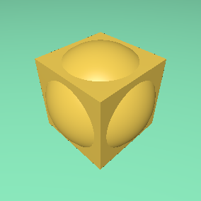
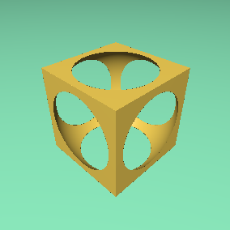
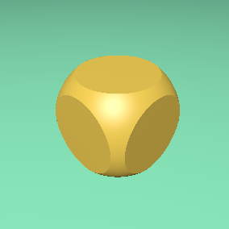

# RayMarcher

This project showcases a sphere-assisted raymarcher capable of rendering 
Constructive Solid Geometry (CSG) shapes using 
Signed Distance Functions (SDFs) with boolean operations.

## RayMarching

Ray marching is a rendering technique similar to 
ray tracing, where rays are cast from the camera 
towards the scene. These rays are traversed
iteratively, checking certain conditions
at each iteration. For efficiency, 
a variation of this algorithm called sphere-assisted 
ray marching is used. 
Using this algorithm and SDFs, at each iteration of
a ray, the following two decisions must be made:

    - How large the step should be
    - Whether the ray has intersected an object

To determine how far the ray will advance 
in the current step, we calculate the distance 
to the nearest implicit surface. This distance 
defines the radius of a sphere that intersects 
the surface. Once the step length is determined, 
we need to check for any intersections. 
This is done easily by evaluating each object. 
If any SDF (Signed Distance Function) is zero 
at the current point, 
it means the ray has intersected a surface.
    
```glsl

vec2 RayMarching(vec3 rayOrigin, vec3 rayDir)
{
    vec2 hit, obj;

    for(int i = 0; i < ITERATIONS; i++)
    {
        vec3 point = rayOrigin + obj.x * rayDir;
        hit = sample(point);
                
        obj.x += hit.x;

        if(abs(hit.x) < EPSILON || obj.x > DISTANCE)
        {
            obj.y += hit.y;
            break;
        }
    }

    return obj;
}

```

## CSGs

CSG (Constructive Solid Geometry) is a technique for creating and modeling geometric surfaces using Boolean operations.
In the case of SDFs (Signed Distance Functions), these operations are performed as follows:

#### UNION:  
$A \cup B = \min(A, B)$

```glsl

vec2 UNION(vec2 CSG_1, vec2 CSG_2)
{
    return (CSG_1.x < CSG_2.x) ? CSG_1 : CSG_2;
}

```

#### INTERSECTION
$A \cap B = \max(A, B)$

```glsl

vec2 INTERSECTION(vec2 CSG_1, vec2 CSG_2)
{
    return (CSG_1.x > CSG_2.x) ? CSG_1 : CSG_2;
}

```

#### DIFFERENCE
$A - B = \max(A, -B)$

```glsl

vec2 DIFFERENCE(vec2 CSG_1, vec2 CSG_2)
{
    return (CSG_1.x > -CSG_2.x) ? CSG_1 : vec2(-CSG_2.x, CSG_2.y);
}

```

| UNION | INTERSECTION | DIFFERENCE|
|---|---|---|
|   |  | |
